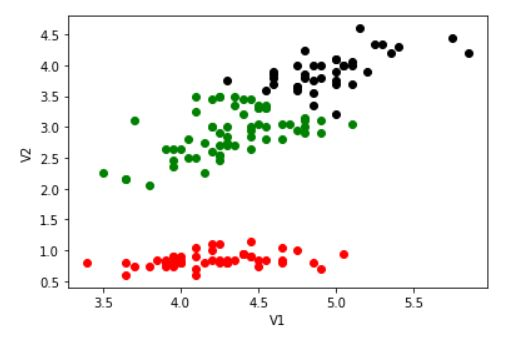
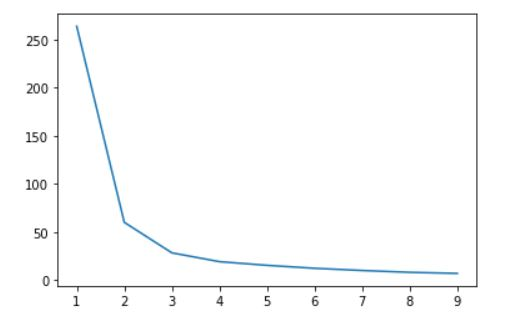

# Rick Gao - ACM Research Coding Challenge (Fall 2020)

## The start
I have never worked with clustering algorithms before, so I did some research to get a basic
understanding of how they work. I have worked with some Data Science libraries before such as matplotlib,
but not anything more complex than graphing arrays of data.

## Learning and Understanding
The first thing I did was to find videos or articles that give a high level overview of clustering.
I found videos to be easier since they were abundant and more enjoyable to learn. 

## Algorithm and Libraries
I chose to use the **K-Means Clustering algorithm**, which computes the clusters by calculating a centroid and 
associating the closest data points to that centroid. The libraries I used were pandas, matplotlib, and sklearn.
I used pandas to read the CSV, matplotlib to graph the clusters, and sklearn to apply the K-Means algorithm.

## Challenges I faced
The coding challenge asked to calculate the number of clusters in the data. I initially had to
hard code the number of clusters so that the clusters could be calculated. However, I did some more research and
learned about the **Elbow technique**, a dynamic way to calculate the amount of clusters needed. 

The above image shows the most fitting number of clusters at the "elbow", in this case k = 3.